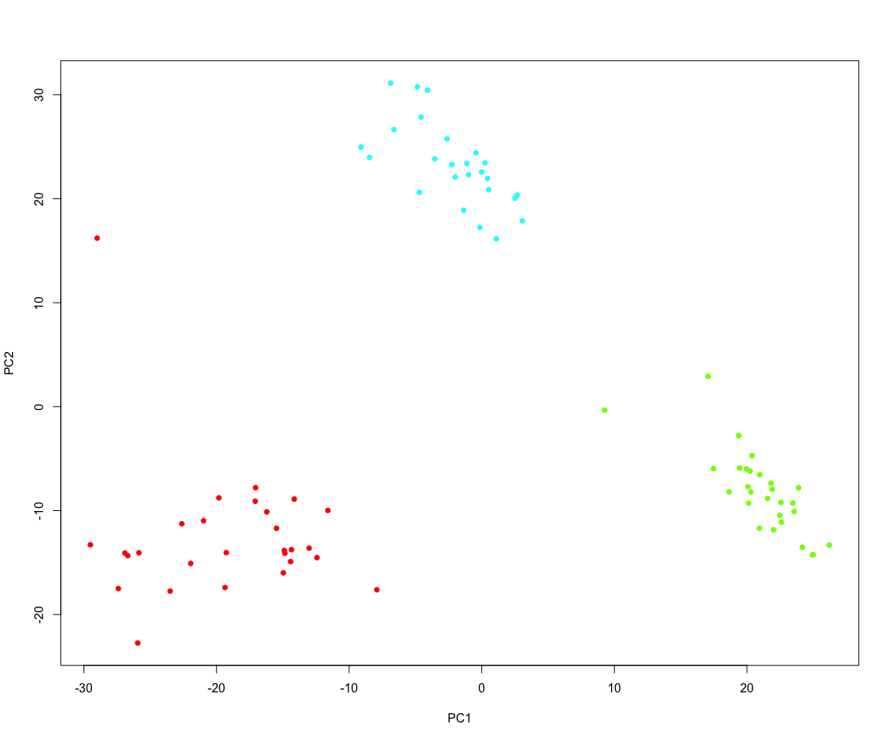

knnClassification
================

Release build:
<a href="https://travis-ci.org/jasonserviss/sp.scRNAseq"></a>

Devel build:
<a href="https://travis-ci.org/jasonserviss/sp.scRNAseq"></a>

Test coverage: [](https://codecov.io/github/jasonserviss/sp.scRNAseq?branch=master)

### Description

A package facilitating unsupervised classification via
k-Nearest-Neighbors and graph-based Louvain community detection.

### Installation

``` r
if(!"devtools" %in% rownames(installed.packages())) {
  install.packages("devtools")
}
devtools::install_github("EngeLab/knnClassification")
```

### Method

The classification works by:

1.  Running a principal component analysis.  
2.  Uses Horn’s technique to evaluate components to retain via the paran
    package.
3.  Finds k nearest neighbors in PCA space.  
4.  Calculates the Euclidean distance between samples in PCA space.  
5.  Constructs a weighted graph where each sample is connected to the k
    nearest neighbors with an edge weight = 1 - Euclidean distance.  
6.  Uses the Louvain community detection algorithm to classify the
    samples.

### Running the algorithm

Two datasets are included in the package which include counts and
metadata for a single cell RNA sequencing experiment performed in 3 cell
lines (A375, HCT116, and HOS). Using this dataset we can run the
algorithm using the following commands:

``` r
library(kNNclassification)

#setup input data
s <- stringr::str_detect(colnames(testCounts), "^s")
e <- stringr::str_detect(rownames(testCounts), "^ERCC\\-[0-9]*$")
c <- testCounts[!e, s]
cpm <- t(t(c) / colSums(c) * 10^6)

#pre-run PCA
pca <- gmodels::fast.prcomp(t(cpm), scale. = TRUE)$x

#run KNN graph classification
kc <- kNNclassify(cpm, 1:nrow(c), 20, 15, pca = pca)
```

    ## 
    ## Using eigendecomposition of correlation matrix.
    ## Computing: 10%  20%  30%  40%  50%  60%  70%  80%  90%  100%

``` r
#plot
pData <- merge(kc, matrix_to_tibble(pca[, 1:2], "sample"))
plot(pData$PC1, pData$PC2, col = rainbow(4)[pData$louvain], pch = 16, xlab = "PC1", ylab = "PC2")
```


